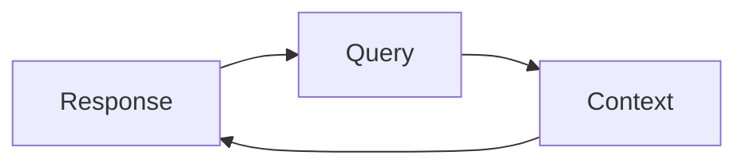

#### What is a Retrieval Augmented Generation (RAG)?  
 - Retrieval, a system that retrieves the information  
 - Augmented, augment the information to be passed 
 - Generation, finally generate the information

#### RAG Triad 
Retrieval-Augmented Generation

 - Context Relevance
 - Groundness
 - Answer Relevance
