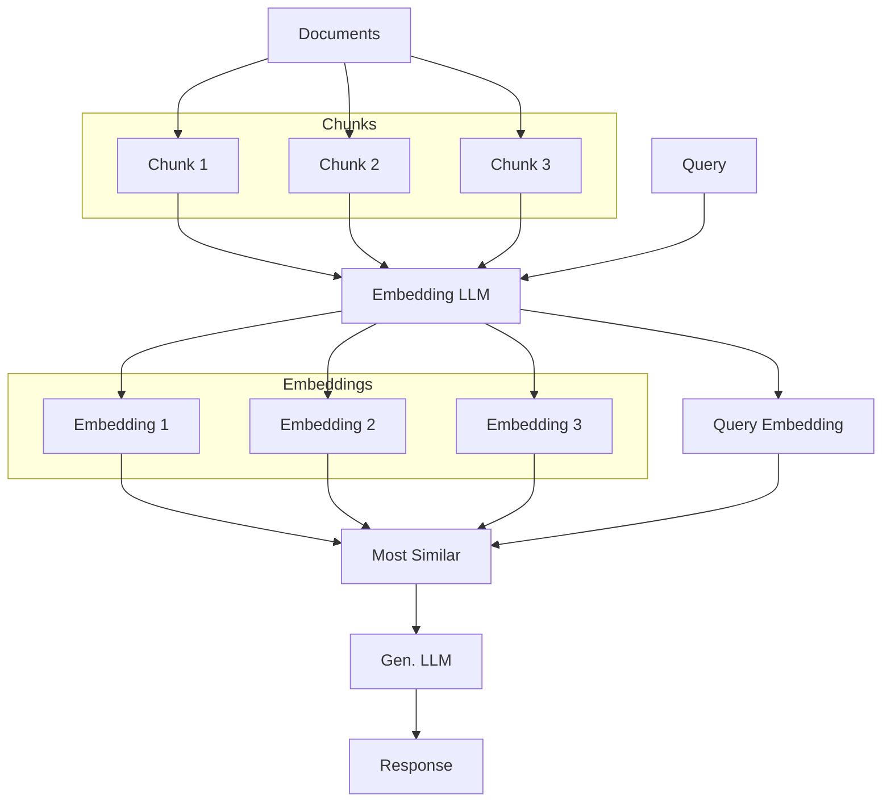
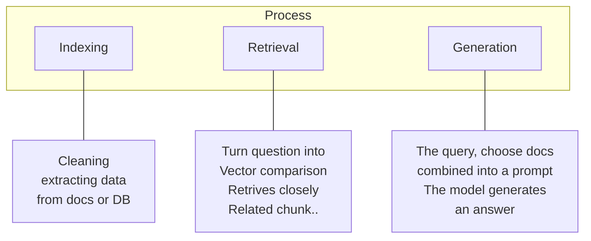

#### Componenets of RAG
 - Retriever
    - Identifies and retrieves relevant documents.
 - Generator
    - Takes retrieved docs and the input query to generate coherent and contextually relevant response

#### What is a RAG?
 - Definition a framework that combines the strengths of retrieval-based systems and generation-based model to produce more accurate and contextual relevant response.
  
    #### LLM
    - LLM knows what it was trained on. After injecting user input data, now LLM know some specific contextual data.

#### RAG Overview 
The generated data is augmented by the data the system retrieved from the documents.  

#### Naive RAG
 - Most simple RAG dealing with LLM

